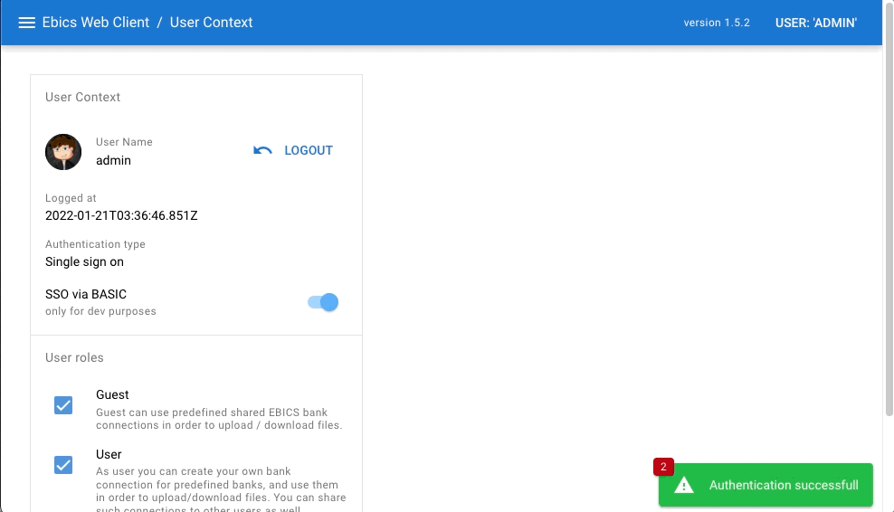

# EBICS Web Client

EBICS Web Client is a web UI to work with EBICS connection to the bank(s) supporting EBICS. The web UI uses REST API backend to execute EBICS orders.   
The core EBICS API is fork of the Java open source [EBICS java client](https://github.com/uwemaurer/ebics-java-client/) repository.
Thanks a lot for all contributions, otherwise this repo would not be here :-)

### Demo application
Check the following [demo](https://ebics-web-client.herokuapp.com/) to get idea about functionality, here is the latest version of app deployed.

### Wiki pages
- [Installation manual](https://github.com/honza-toegel/ebics-java-client/wiki/Installation-Manual)
- [Getting started](https://github.com/honza-toegel/ebics-java-client/wiki/Getting-Started)

### Functionality
Main differences with this fork:

- Web UI (SPA based on vue3), instead of console client
- REST API exposing EBICS operations
- Support of following EBICS versions 
  - EBICS 2.5 (H004)
  - EBICS 3.0 (H005)
- Added API for HTD & HEV
- Support of bcprov-jdk15on
- Some core API refactored to kotlin in order to increase readability, encapsulation and immutability and consistence

### Ideas for roadmap:

- Display hash of X509 Bank Certificates
- Better unit test coverage
- More business friendly Web UI for users which doesn't know anything about EBICS (like classical eBanking UI)
- Implementing UserDetailService to maintain user data  
- Download file indexing in order to find relevant data (like payment status by id, account statement by transaction,..) 
- Replace xmlbeans with JAXB
- Enhance re-usability of the submodules
  - Ensure that ebics-java-lib can be used standalone if somebody need completely other use-case
  - Reduce tight coupling between ebics-dbmodel and ebics-rest-api